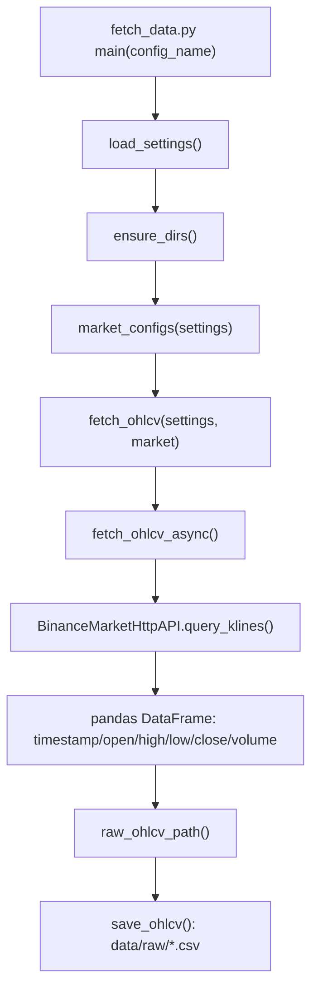
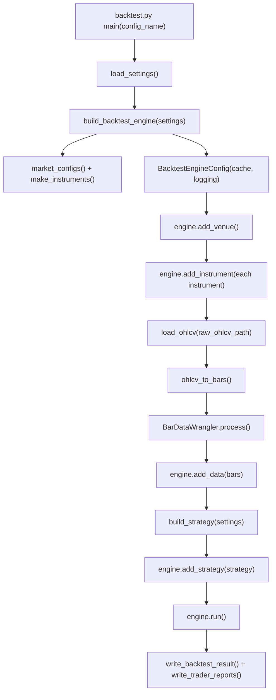
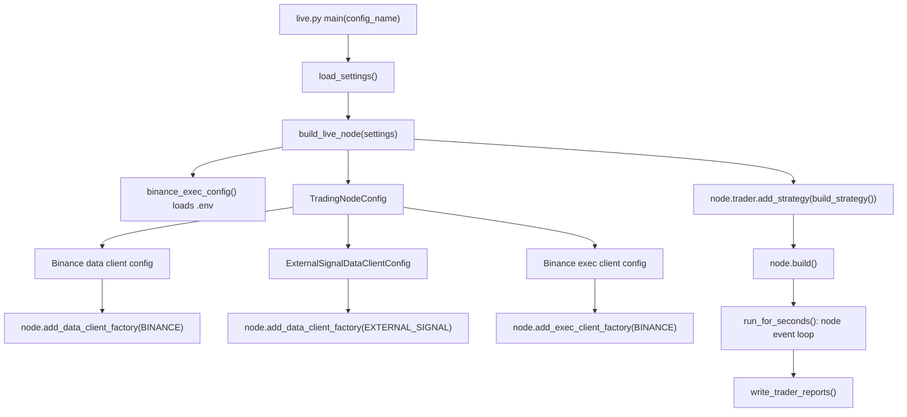
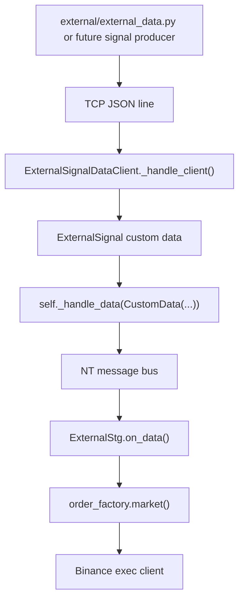
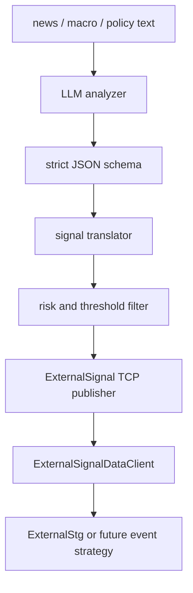

# nt_quant 项目逻辑与后续开发文档

本文不是项目使用说明，而是对当前代码的逻辑、框架、数据流、函数调用关系和后续开发方向的整理。当前项目处在早期原型阶段，整体思路很清晰：用 NautilusTrader 承担回测、实盘节点、事件循环、订单和账户模型；项目自身保留轻量的配置层、数据抓取层、instrument 构造层、策略装配层和少量策略实现。

## 1. 项目定位

这个项目的目标是搭一个面向 crypto 的 NautilusTrader 量化框架。它不是从零实现交易引擎，而是在 NT 上做一层薄封装，让同一套策略配置可以被三类入口复用：

- `fetch_data.py`：按配置抓 Binance OHLCV，并落地到本地原始 CSV。
- `backtest.py`：读取本地 OHLCV，转换为 NT Bar，构建 BacktestEngine 后运行策略。
- `live.py`：构建 NT TradingNode，接入 Binance live/testnet data/exec client，同时注册本地外部信号 data client。

项目的核心设计是“配置驱动策略选择”。入口脚本不应该知道具体策略是谁，也不应该为某个策略写分支。`config/*.yaml` 里的 `strategy.name` 决定策略模块、策略类和策略配置类，`utils/strategy_factory.py` 再用动态导入完成实例化。

## 2. 当前目录职责

```text
nt_quant/
  backtest.py                  # 通用回测入口
  fetch_data.py                # 通用历史数据抓取入口
  live.py                      # 通用实盘/测试网入口

  config/
    global.yaml                # 环境级配置：项目目录、交易所、venue、代理、外部信号端口
    ema_cross_1.yaml           # 单标的现货 EMA 交叉 set
    futures_trend_1.yaml       # 单标的 U 本位合约趋势 set
    cross_momentum_1h_1.yaml   # 多标的相对动量 set
    external_stg_1.yaml        # 外部信号驱动 set

  utils/
    config_loader.py           # 配置合并、归一化、market 列表与目录
    instrument_factory.py      # NT instrument id、instrument、bar type 构造
    market_data.py             # Binance OHLCV 抓取、CSV 保存/读取、OHLCV -> NT Bar
    strategy_factory.py        # 根据配置动态构建策略实例
    binance_clients.py         # Binance live data/exec client 配置
    report_writer.py           # NT 订单/成交/持仓/回测结果报告输出

  strategies/
    ema_cross.py               # 单标的 EMA 交叉策略
    futures_trend.py           # 单标的合约趋势策略，EMA + ATR 过滤
    cross_momentum.py          # 多标的相对 BTC 动量轮动策略
    external_stg.py            # 订阅外部信号并下市价单

  external/
    data_engine.py             # NT LiveDataClient：本地 TCP 外部信号接入
    external_data.py           # 简单随机信号发送器
    ai_api.py                  # LLM 分析实验脚本
    prompt.py                  # LLM 分析提示词

  data/raw/                    # 已抓取的原始 OHLCV CSV
  reports/                     # 已存在的历史报告目录
```

## 3. 分层逻辑

### 3.1 配置层

配置入口是 `utils/config_loader.py` 的 `load_settings(config_name)`。

加载顺序：

1. 读取 `config/global.yaml`。
2. 读取 `config/{config_name}.yaml`。
3. 用 `deep_merge()` 递归合并，set 配置覆盖 global 配置。
4. `normalize_settings()` 补齐可推导字段。
5. 写入 `settings["project"]["config_name"]`。

`global.yaml` 只放环境级信息：项目目录、数据目录、报告目录、交易所名称、NT venue、代理、外部信号监听地址。每个 set 文件放策略级和运行级信息：策略名、交易参数、market/markets、backtest/live 账户、instrument 精度和限制。

归一化逻辑主要做三件事：

- `normalize_market()` 从 `symbol` 推导 `base_currency`、`quote_currency`、`raw_symbol`、`instrument_symbol`、`venue`、`exchange` 等字段。现货默认 `BTCUSDT`，永续默认 `BTCUSDT-PERP`。
- `normalize_strategy()` 从 `strategy.name` 推导 `strategy.module`、`strategy.class`、`strategy.config_class`。例如 `ema_cross` 会推导到 `strategies.ema_cross`、`EmaCross`、`EmaCrossConfig`。
- `market_configs()` 统一返回 market 列表：多标的 set 用 `markets`，单标的 set 用单个 `market` 包成列表。

这个设计让入口脚本只处理通用流程，策略扩展主要发生在 `strategies/` 和 `config/`。

### 3.2 Instrument 与 BarType 层

`utils/instrument_factory.py` 负责把配置转换为 NautilusTrader 的交易对象：

- `instrument_id()` 生成 `InstrumentId(Symbol(...), Venue(...))`。
- `make_currency_pair()` 构造现货 `CurrencyPair`。
- `make_crypto_perpetual()` 构造 U 本位永续 `CryptoPerpetual`。
- `make_instrument()` 根据 `instrument.kind` 在现货和永续之间选择。
- `make_instruments()` 对所有 markets 批量构造。
- `make_bar_type()` 把 `1m/1h/1d` 转成 NT bar spec，并生成形如 `BTCUSDT-PERP.BINANCE-1-MINUTE-LAST-EXTERNAL` 的 `BarType`。

这里是项目和 NT 模型的核心接缝。策略里不直接拼 symbol，也不直接读 YAML 精度；策略只拿 `InstrumentId`、`BarType` 和 NT cache 中的 `Instrument`。

### 3.3 策略装配层

`utils/strategy_factory.py` 的 `build_strategy(settings)` 是策略实例化中心。

单标的 set：

- 构造一个 instrument。
- 构造一个 bar type。
- 给策略配置类传入 `instrument_id`、`bar_type`、`trade_size` 和 `strategy.params`。

多标的 set：

- 构造一组 instruments。
- 构造一组 bar types。
- 给策略配置类传入 `instrument_ids`、`bar_types`、`trade_notional` 和 `strategy.params`。

因此当前策略配置类分为两种形态：

- 单标的策略配置类：`instrument_id + bar_type + trade_size`。
- 多标的策略配置类：`instrument_ids + bar_types + trade_notional`。

后续新增策略时，只要遵守这两类接口之一，`backtest.py` 和 `live.py` 不需要改。

## 4. 数据流

### 4.1 历史数据抓取流



`fetch_ohlcv_async()` 使用 NT 的 Binance HTTP adapter 拉取 kline。它按 `limit` 和 `batches` 反向分页：每次取一批，下一批的 `end_time` 设置为上一批第一根 K 线的 `open_time - 1`。最终 DataFrame 保存为标准 OHLCV CSV。

当前数据抓取层的一个重要事实：它用 `settings["live"]["account_type"]` 选择 Binance account type，但 HTTP base URL 固定使用 Binance live public market data。也就是说，历史行情抓取不是 testnet 数据，而是 Binance 公共真实行情。

### 4.2 回测流



回测引擎构建步骤：

1. 从配置得到 markets 和 instruments。
2. 创建 `BacktestEngine`，设置 NT cache 和 logging。
3. 用第一个 market 的 venue 添加交易场所。当前所有 set 都是 Binance，所以这没问题；如果未来支持多 venue，这里需要扩展。
4. 把每个 instrument 加到 engine。
5. 对每个 market 读取对应 CSV。
6. 用 `ohlcv_to_bars()` 把普通 OHLCV DataFrame 转成 NT Bar。
7. 动态构建策略并加入 engine。
8. 运行后输出回测结果和 trader 报告。

### 4.3 实盘/测试网流



实盘入口注册两个 data client：

- Binance live data client：用于行情和 instrument provider。
- External signal live data client：一个本地 TCP server，用于接收外部信号。

同时注册一个 Binance exec client，用 `.env` 里的 key/secret 连接 testnet 或 live。`live.py` 里的 `run_for_seconds()` 使用 NT node 自己的 event loop，定时调用 `node.stop_async()`，避免和外部 asyncio loop 冲突。

当前 `live.py` 文件末尾默认 `main("external_stg_1")`，但入口函数内部仍然遵守“命令行参数优先”的规则：有 CLI 参数时会覆盖这个默认值。

## 5. 策略逻辑

### 5.1 EmaCross

文件：`strategies/ema_cross.py`

这是单标的 EMA 交叉策略：

1. `on_start()` 从 NT cache 取 instrument，注册 fast EMA 和 slow EMA。
2. 如配置允许，调用 `request_bars()` 请求历史 bar 预热。
3. 订阅实时 bar。
4. `on_bar()` 等指标初始化后比较快慢 EMA。
5. 快线大于等于慢线时目标方向为多；快线小于慢线时目标方向为空。
6. 如果当前持仓方向不一致，先平旧方向，再发市价单。
7. `on_stop()` 取消订单、按配置平仓、取消订阅。

策略只做方向切换，不做止损、止盈、仓位缩放或风控限制。

### 5.2 FuturesTrend

文件：`strategies/futures_trend.py`

这是单标的 U 本位合约趋势策略：

1. 使用 fast EMA、slow EMA 判断趋势方向。
2. 使用 ATR 做最小波动过滤：`atr.value < min_atr` 时不交易。
3. 快线在慢线上方时调成净多；快线在慢线下方时调成净空。
4. 下单方式仍是固定数量市价单。

它和 `EmaCross` 非常接近，差别是加入 ATR 过滤，并且默认面向永续合约配置。

### 5.3 CrossMomentum

文件：`strategies/cross_momentum.py`

这是多标的相对动量策略，当前配置中用 BTC 作为基准，比较 ETH、BNB、DOGE、TRUMP、SOL 等合约相对 BTC 的表现。

核心状态：

- `bar_to_instrument`：把每个 `BarType` 映射回 instrument。
- `closes`：每个 instrument 一个 deque，保存最近 `lookback_bars + 1` 个收盘价。
- `seen_this_ts`：记录当前 timestamp 已收到哪些标的的 bar。
- `last_bar_ts`：跳过重复或倒序 bar。
- `cache_warmed`：是否已经从 NT cache 中读完历史 bar 做预热。

运行逻辑：

1. `on_start()` 对每个 instrument 检查 cache，订阅每个 bar type。
2. `on_bar()` 先尝试从 NT cache 预热历史收盘价。
3. 对每根 bar 写入对应 instrument 的 close deque。
4. 等同一 timestamp 的所有标的 bar 都到齐后再调仓。
5. `_rebalance()` 计算每个非基准标的的收益率减去 BTC 收益率。
6. 相对强的前 `long_count` 个做多，相对弱的后 `short_count` 个做空，中间标的平仓。
7. 每个目标仓位用固定 `trade_notional / last_price` 换算数量。

这个策略已经体现出框架支持组合级策略的方向。它比单标的策略多了一个关键约束：多条 bar 流需要按 timestamp 对齐，否则会用错横截面。

### 5.4 ExternalStg

文件：`strategies/external_stg.py`

这是外部信号驱动策略：

1. `on_start()` 从 NT cache 取 instrument，并订阅 `ExternalSignal` custom data。
2. `on_data()` 收到外部信号后计算信号延迟。
3. 将 `"BUY"` 或 `"SELL"` 映射为 NT `OrderSide`。
4. 调用 `_market()` 按固定数量发市价单。
5. `on_stop()` 取消订单、按配置平仓、取消 custom data 订阅。

这个策略目前只做“信号到订单”的最短链路验证。它还没有信号去重、过期时间、置信度过滤、最大仓位约束或方向状态机。

## 6. 外部信号链路



`external/data_engine.py` 实现了一个 NT `LiveDataClient`。连接时它在 `external_signal.host:external_signal.port` 开一个 asyncio TCP server。每个外部客户端发送一行 JSON：

```json
{
  "instrument_id": "BTCUSDT-PERP.BINANCE",
  "side": "BUY",
  "sent_ns": 1777566031867000064
}
```

data client 收到后构造 `ExternalSignal`，包成 NT `CustomData` 推进 NT 数据事件系统。策略不需要自己开 socket，也不需要处理线程或事件循环。

`external/external_data.py` 是随机 BUY/SELL 信号发送器，用于验证链路。`external/ai_api.py` 和 `external/prompt.py` 是 LLM 分析方向的实验代码，目前还没有接入 `ExternalSignal` 标准消息。

## 7. 函数调用关系总览

### 7.1 fetch_data.py

```text
main()
  -> load_settings()
       -> deep_merge()
       -> normalize_settings()
            -> normalize_market()
            -> normalize_strategy()
  -> ensure_dirs()
  -> market_configs()
  -> fetch_ohlcv()
       -> fetch_ohlcv_async()
            -> BinanceMarketHttpAPI.query_klines()
  -> raw_ohlcv_path()
  -> save_ohlcv()
```

### 7.2 backtest.py

```text
main()
  -> load_settings()
  -> build_backtest_engine()
       -> market_configs()
       -> make_instruments()
            -> make_instrument()
                 -> make_currency_pair() or make_crypto_perpetual()
       -> cache_config()
       -> engine.add_venue()
       -> engine.add_instrument()
       -> raw_ohlcv_path()
       -> load_ohlcv()
       -> ohlcv_to_bars()
            -> make_instrument()
            -> make_bar_type()
            -> BarDataWrangler.process()
       -> build_strategy()
            -> importlib.import_module(strategy.module)
            -> config_cls(...)
            -> strategy_cls(config)
       -> engine.add_strategy()
  -> engine.run()
  -> write_reports()
       -> write_backtest_result()
       -> write_trader_reports()
       -> print_backtest_summary()
  -> engine.dispose()
```

### 7.3 live.py

```text
main()
  -> load_settings()
  -> build_live_node()
       -> binance_exec_config()
            -> load_dotenv()
            -> instrument_provider()
                 -> make_instruments()
       -> binance_data_config()
            -> instrument_provider()
            -> venue_ids()
       -> ExternalSignalDataClientConfig()
       -> TradingNode(...)
       -> add_data_client_factory(BINANCE)
       -> add_data_client_factory(EXTERNAL_SIGNAL)
       -> add_exec_client_factory(BINANCE)
       -> build_strategy()
       -> node.build()
  -> run_for_seconds()
       -> node.get_event_loop()
       -> loop.call_later(... node.stop_async())
       -> node.run()
  -> write_trader_reports()
  -> node.dispose()
```

## 8. 当前框架的优点

1. 入口脚本足够薄  
   `fetch_data.py`、`backtest.py`、`live.py` 都是通用入口，业务差异主要沉在配置和策略文件里。

2. 配置分层方向正确  
   `global.yaml` 放环境项，set yaml 放策略和运行项。这个边界适合后续扩展更多策略。

3. NT 原生对象贯穿主流程  
   instrument、bar type、strategy config、data client、exec client 都尽量使用 NautilusTrader 原生组件，避免自己实现交易引擎。

4. 已同时覆盖单标的、多标的、外部信号三类策略形态  
   这说明当前抽象不是只服务一个 demo 策略，而是已经开始支持不同策略范式。

5. 外部信号设计方向干净  
   外部进程只负责发送 JSON 信号，NT 侧用 data client 接收并转成事件，策略仍然通过 NT 标准回调消费数据。

## 9. 当前需要注意的问题

这些不是要求立即改代码，而是后续开发前应该优先确认的技术债。

1. 报告输出路径需要统一  
   `utils/config_loader.py` 里有 `reports_dir(settings)`，返回 `reports/{config_name}`；但 `utils/report_writer.py` 当前 `run_reports_dir()` 返回的是 `{ROOT}/{run_type}/reports`。这和已有 `reports/external_stg_1` 目录以及注释意图不完全一致。后续建议统一为 `reports/{config_name}/{run_type}/...`。

2. 当前运行环境依赖没有显式固化  
   项目依赖 `nautilus_trader`、`pandas`、`yaml/PyYAML`、`python-dotenv`、`rich`、`openai` 等，但仓库里还没有明确的依赖文件。后续协作和自动化测试会受影响。

3. 数据文件还是原始 CSV，缺少数据目录索引  
   当前文件名能表达 exchange、instrument、timeframe，但没有记录抓取时间、起止区间、数据版本、去重状态、缺失检查结果。

4. 回测还缺少成交假设  
   目前主要依赖 NT 的基础撮合和 instrument 费用参数。后续如果策略开始比较收益质量，需要明确 slippage、funding、mark/index price、手续费、成交延迟和 bar 内成交假设。

5. 实盘保护还很少  
   目前策略能直接发市价单。真正连 testnet 或 live 前，应该加入最大单笔名义金额、最大持仓、日内亏损上限、信号过期、信号去重、kill switch、dry-run 等保护。

6. 外部 AI 分析还没有进入交易闭环  
   `external/ai_api.py` 目前只是调用模型并打印结果。它还没有把 JSON 分析结果转换为 `ExternalSignal`，也没有置信度、币种映射、动作阈值或风控网关。

7. 多标的策略默认共用 instrument 精度  
   `cross_momentum_1h_1.yaml` 用一套通用 instrument 精度覆盖所有合约。真实交易时不同币种的 tick size、step size、min notional 可能不同。后续应该支持 per-market instrument override 或从交易所 instrument provider 固化快照。

8. 缺少自动化测试  
   当前最需要测的是配置归一化、BarType 生成、instrument 构造、策略 factory、多标的 timestamp 对齐逻辑、外部信号 JSON 到 `ExternalSignal` 的转换。

## 10. 后续开发路线

建议按“先稳框架，再扩能力”的顺序做。不要先上复杂策略，否则问题会混在数据、回测、执行、风控、策略本身之间，定位成本很高。

### 阶段一：框架稳定化

目标：让每次运行可复现、可追踪、可比较。

建议功能：

1. 统一报告目录  
   推荐结构：

   ```text
   reports/
     {config_name}/
       backtest/
         run_YYYYMMDD_HHMMSS/
           config_snapshot.yaml
           data_manifest.json
           backtest_result.json
           orders.csv
           fills.csv
           positions.csv
       live/
         run_YYYYMMDD_HHMMSS/
           config_snapshot.yaml
           orders.csv
           fills.csv
           positions.csv
   ```

   实现位置：`utils/report_writer.py`。保留入口脚本不变，只让 report writer 负责路径组织。

2. 增加运行 manifest  
   每次回测记录 config name、策略名、markets、数据文件路径、数据起止时间、bar 数量、运行时间、Python/NT 版本。如果 git 状态可用，再记录 commit hash。

   实现位置：新增 `utils/run_manifest.py` 或直接先放在 `utils/report_writer.py`，等重复变多再抽出去。

3. 固化依赖  
   新增 `requirements.txt` 或 `pyproject.toml`，最少列出当前实际 import 的依赖。先不要引入复杂构建系统。

4. 最小测试集  
   用 pytest 覆盖纯函数：

   - `deep_merge()`
   - `normalize_market()`
   - `normalize_strategy()`
   - `timeframe_to_bar_spec()`
   - `raw_ohlcv_path()`
   - `build_strategy()` 的单标的/多标的 config 参数形态

### 阶段二：数据层增强

目标：让数据从“能用”变成“可信”。

建议功能：

1. 增量抓取  
   读取已有 CSV 的最后 timestamp，只抓后续数据，合并后按 timestamp 去重排序。

   实现位置：`utils/market_data.py`。新增 `append_ohlcv()`，`fetch_data.py` 仍然只循环 markets。

2. 数据质量检查  
   保存前检查 timestamp 是否单调递增、是否有重复、是否有缺口、OHLC 是否满足 `high >= open/close >= low` 的基本约束。

   实现位置：`utils/market_data.py`。先返回一个小 dict，后续写进 manifest。

3. Parquet 存储  
   CSV 便于查看，但多币种和长周期会变慢。可以保留 CSV 或改为 Parquet 主存储、CSV 只作为导出。

4. 交易所 instrument 信息快照  
   从 Binance instrument provider 或 exchange info 读取真实 tick size、step size、min notional，写入本地快照，再由 set 引用。这样多标的策略不需要共用一套粗略精度。

### 阶段三：回测可信度提升

目标：让回测结果更接近真实交易成本和约束。

建议功能：

1. 手续费、滑点、funding 建模  
   永续合约策略必须把 funding 纳入结果，否则持仓时间稍长就容易误判。

2. 参数扫描和 walk-forward  
   不建议一开始做大而全优化框架。可以先做一个脚本读取 config 模板，替换 `strategy.params`，批量跑回测并汇总关键指标。

3. 组合层风险指标  
   在 `backtest_result.json` 和 positions 基础上计算最大回撤、收益波动、胜率、盈亏比、平均持仓时间、换手、手续费占比。

4. 多标的对齐检查  
   对 `CrossMomentum` 这类策略，在进入回测前检查所有 markets 的 bar timestamp 是否一致，避免横截面排序混入缺失数据。

### 阶段四：实盘安全网

目标：先保证不会因为外部信号、配置错误或网络异常导致不可控下单。

建议功能：

1. Order guard  
   在策略发单前统一检查：

   - 最大单笔 notional
   - 最大净仓位
   - 最大日内下单次数
   - 最大日内亏损
   - 是否允许做空
   - 是否允许 live 环境

   实现方式：先不要做复杂中间层。可以在策略 helper 函数里做最小检查，等多个策略重复后再抽 `utils/order_guard.py`。

2. 外部信号 TTL 和去重  
   `ExternalSignal` 增加 `signal_id`、`created_ns`、`expires_ns`、`confidence`。策略收到信号时，如果过期、重复或置信度低，直接忽略。

3. dry-run 模式  
   在 `live` 配置中加入 `dry_run: true`，策略走完整数据链路和日志，但不 submit order。第一版可以在策略里判断，后续再考虑统一封装。

4. 停机和告警  
   明确 node 停止时是否强制平仓，记录 stop reason。关键异常写入单独日志，并预留 webhook/邮件/消息通知。

### 阶段五：外部 AI 信号闭环

目标：把 `external/ai_api.py` 从实验脚本变成可审计的信号生产器。

建议架构：



实现要点：

1. 保持 AI 进程和交易进程分离  
   AI 只产出信号，不直接碰 NT trader 和 exec client。

2. 严格校验 JSON  
   用 schema 或 Pydantic 校验 `impact_score`、`direction`、`suggested_action`、`affected_coins`、`confidence`。校验失败不发信号。

3. 明确信号映射  
   例如：

   - `impact_score >= 7`
   - `confidence in {"medium", "high"}`
   - `direction == "bullish"` 映射 BUY
   - `direction == "bearish"` 映射 SELL
   - 只允许映射到配置中存在的 instruments

4. 加入人工可审计日志  
   每条 AI 输出、过滤原因、最终信号都写入 append-only JSONL。交易亏损时必须能还原当时为什么下单。

### 阶段六：策略扩展

目标：在框架稳定后再增加真正可比较的策略。

适合下一批策略：

1. 单标的趋势策略增强版  
   在 `FuturesTrend` 基础上加入 ATR stop、移动止损、波动率缩放仓位。

2. 多标的截面策略增强版  
   在 `CrossMomentum` 基础上加入成交量过滤、波动率标准化、最大相关性限制、动态 long/short 数量。

3. 事件驱动策略  
   以 `ExternalStg` 为起点，但把外部信号变成带 TTL、confidence、target_notional、reason 的结构化事件。

4. 市场状态过滤器  
   用 BTC 趋势、波动率、资金费率或流动性状态控制策略是否开仓。

## 11. 推荐的近期开发顺序

如果只选最近最值得做的 6 件事，建议顺序如下：

1. 统一报告输出路径，并让每次 run 有独立目录。
2. 增加 config snapshot 和 data manifest，让回测结果可复现。
3. 补最小 pytest，先覆盖配置归一化和 factory。
4. 给历史数据增加去重、缺口检查和增量更新。
5. 给 live/external signal 增加 TTL、去重和最大下单限制。
6. 把 AI 输出接成严格 JSON -> signal translator -> TCP publisher，但先只跑 dry-run。

这个顺序的原因是：报告和 manifest 解决“结果能不能追溯”；测试解决“框架能不能继续改”；数据质量解决“回测输入是否可信”；live guard 解决“是否能安全接信号”；AI 闭环最后接入，避免模型输出直接进入不稳的交易链路。

## 12. 新功能如何落地

### 12.1 新增普通单标的策略

应触碰的文件：

- 新增 `strategies/{strategy_name}.py`
- 新增 `config/{strategy_name}_1.yaml`

策略配置类保持：

```python
class MyStrategyConfig(StrategyConfig, frozen=True):
    instrument_id: InstrumentId
    bar_type: BarType
    trade_size: Decimal
    # strategy-specific params...
```

只要 `strategy.name: my_strategy`，配置层会自动推导：

- module: `strategies.my_strategy`
- class: `MyStrategy`
- config_class: `MyStrategyConfig`

入口脚本不需要新增分支。

### 12.2 新增多标的组合策略

应触碰的文件：

- 新增 `strategies/{strategy_name}.py`
- 新增 `config/{strategy_name}_1.yaml`，使用 `markets:` 而不是单个 `market:`

策略配置类保持：

```python
class MyPortfolioConfig(StrategyConfig, frozen=True):
    instrument_ids: list[InstrumentId]
    bar_types: list[BarType]
    trade_notional: Decimal
    # strategy-specific params...
```

多标的策略必须自己处理 bar 对齐问题。`CrossMomentum` 当前的 `seen_this_ts` 模式可以作为第一版模板。

### 12.3 新增交易所或多 venue

当前代码默认 Binance，且 backtest `add_venue()` 用第一个 market 的 venue。扩展多交易所时需要：

1. `global.yaml` 或 set yaml 支持 per-market exchange/venue。
2. `market_data.py` 把 fetcher 抽成按 exchange 选择。
3. `instrument_factory.py` 确认不同 venue 的 symbol 规则。
4. `backtest.py` 对每个 unique venue 调用 `engine.add_venue()`。
5. `binance_clients.py` 扩展为更通用的 exchange client config，或保留 Binance 专用文件再新增其他交易所文件。

在没有真实需求前，不建议现在抽象多交易所层。当前保持 Binance 专用更简单。

### 12.4 把 AI 分析接入交易

第一版不应该让 AI 直接下单。推荐新增一个外部进程：

```text
external/
  ai_signal_publisher.py
```

职责：

1. 调用 `ai_api` 得到严格 JSON。
2. 校验 JSON。
3. 根据规则转换成 `ExternalSignal` JSON。
4. 写本地 JSONL 审计日志。
5. 通过 TCP 发给 `ExternalSignalDataClient`。

交易进程只信任结构化信号，不关心 LLM 调用细节。

## 13. 总结

当前项目最有价值的设计点是：把 NautilusTrader 放在中心，项目代码只做必要的配置、数据、instrument 和策略 glue。这个方向是对的，尤其适合早期快速验证策略。

下一步不要急着堆策略数量。更应该先把报告、manifest、数据质量、最小测试和 live guard 补起来。这样后续无论是做更复杂的多币种轮动，还是把 AI 新闻分析接成外部信号，都能在同一个可追溯、可复现、可控风险的框架里推进。
