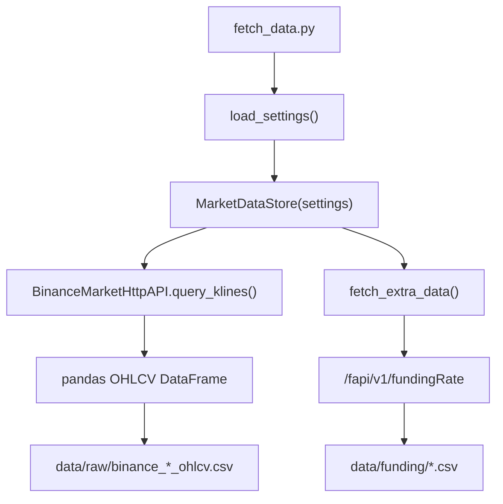
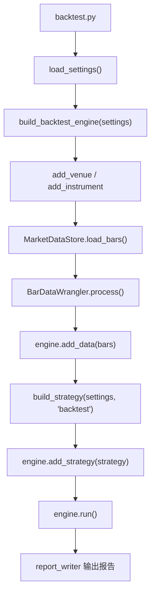
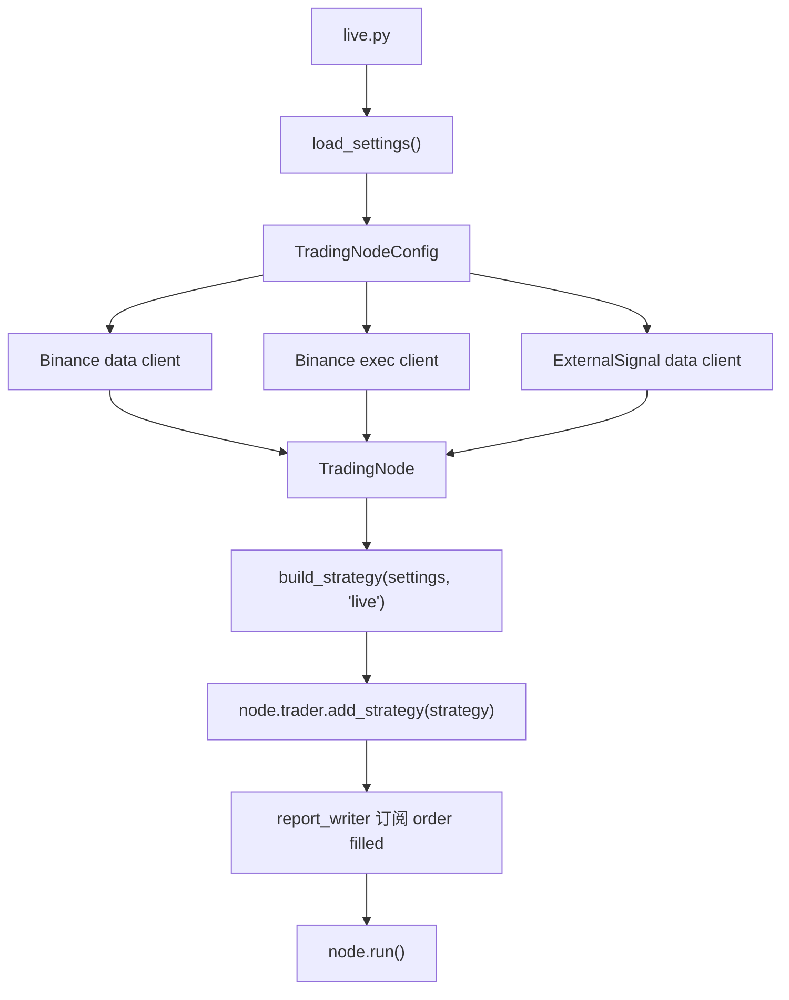

# nt_quant 项目逻辑、Funding 策略设计与后续规划

本文记录当前项目的运行结构、数据流、资金费策略设计、回测和测试网结果。当前项目只保留两类策略：

- `funding`：主策略，围绕 U 本位永续合约资金费结算做交易。
- `demo_multi_asset`：综合样例策略，用来展示多品种、指标预热、bar 回调、外部数据源订阅、订单/持仓事件回调等 NT 常用结构。

## 1. 当前目录职责

```text
nt_quant/
  fetch_data.py                 # 通用数据拉取入口
  backtest.py                   # 通用回测入口
  live.py                       # 通用测试网/实盘入口
  PROJECT_LOGIC_AND_ROADMAP.md  # 当前项目说明和规划

  config/
    global.yaml                 # 全局配置：项目目录、交易所、代理、外部信号端口、默认 live 参数
    funding.yaml                # funding 策略 set
    demo_multi_asset_1.yaml     # 综合样例 set

  strategies/
    funding.py                  # 资金费策略
    demo_multi_asset.py         # 多品种综合样例策略

  utils/
    config_loader.py            # 加载 global + set，并补齐可推导配置
    instrument_factory.py       # 构建 NT InstrumentId、Instrument、BarType
    market_data.py              # 拉取 Binance OHLCV，保存 CSV，转换为 NT Bar
    strategy_factory.py         # 按 set 动态构建策略对象
    binance_clients.py          # Binance live/testnet data/exec client 配置
    report_writer.py            # 回测/live 报告落盘、清洗、汇总

  external/
    data_engine.py              # NT LiveDataClient：本地 TCP 外部信号接入
    external_data.py            # 外部信号发送进程，保留给你继续改
    ai_api.py / prompt.py       # 外部 AI 信号实验代码

  data/raw/                     # OHLCV CSV
  data/funding/                 # funding rate CSV
  reports/backtest/{set_name}/  # 回测输出
  reports/live/{set_name}/      # live 输出
```

## 2. 运行方式

命令行参数优先，`main(config_name)` 只是 IDE 里直接运行时的兜底。

```powershell
# 拉 funding.yaml 里配置的 OHLCV；如果 set 有 funding_csv_path，也会更新资金费 CSV
D:\app\miniconda\envs\nt\python.exe fetch_data.py funding

# 跑 funding 回测
D:\app\miniconda\envs\nt\python.exe backtest.py funding

# 跑 funding 测试网/live，默认读取 config/funding.yaml 的 live.run_seconds
D:\app\miniconda\envs\nt\python.exe live.py funding

# 跑综合样例回测
D:\app\miniconda\envs\nt\python.exe backtest.py demo_multi_asset_1
```

新增策略时，原则上只加两个文件：

- `strategies/{strategy_name}.py`
- `config/{strategy_name}_1.yaml`

只要 set 里有 `strategy.name`，`utils/config_loader.py` 会推导：

- `strategy.module = strategies.{name}`
- `strategy.class = snake_case -> PascalCase`
- `strategy.config_class = {ClassName}Config`

入口脚本不为具体策略写分支。

## 3. 配置流

`load_settings(config_name)` 的流程：

1. 读取 `config/global.yaml`。
2. 读取 `config/{config_name}.yaml`。
3. 用 set 覆盖 global 的重复字段。
4. 补齐 market、strategy、instrument 的可推导字段。
5. 写入 `settings["project"]["config_name"]`。

边界划分：

- `global.yaml` 放环境级参数：交易所、venue、代理、报告目录、外部信号端口。
- set yaml 放策略级参数：symbol、timeframe、trade_size、回测账户、live 运行时间、instrument 精度和手续费。

## 4. 数据流

### 4.1 拉取 OHLCV 和额外行情



OHLCV 拉取使用 NautilusTrader 的 Binance HTTP adapter。Binance U 本位 Kline 接口是 `/fapi/v1/klines`，K 线由 open time 唯一标识。当前保存为普通 CSV，回测前再转换为 NT `Bar` 对象。

如果 set 的 `strategy.params` 里声明了 `funding_csv_path`，`fetch_data.py` 会额外调用 Binance `/fapi/v1/fundingRate`，把资金费历史写到该路径。拉取数量由 `data.funding_limit` 控制。入口仍然不判断具体策略名，只看配置是否需要额外行情。

### 4.2 回测



回测不是直接把 DataFrame 交给策略，而是通过 `BarDataWrangler` 转成 NautilusTrader 的 `Bar` 列表，再交给 `BacktestEngine`。策略收到的是标准 NT `on_bar(bar)` 回调。

### 4.3 测试网/live



live 下 `TraderReportWriter.attach_live_fills()` 会订阅：

```python
node.trader.subscribe(f"events.order.{strategy.id}", self.handle_order_event)
```

逻辑是：NT trader 收到订单事件后发布到 message bus；订阅了当前策略订单事件 topic 的 handler 会被调用；handler 只在事件是 `OrderFilled` 时追加写入 `reports/live/{set_name}/fills.csv`。这样 live 成交后可以边跑边读报告文件。

## 5. Funding 策略设计

目标：赚取 U 本位永续合约资金费，同时尽量缩短价格暴露时间。

策略文件：`strategies/funding.py`

核心参数在 `config/funding.yaml`：

- `market.symbol: LAB/USDT`
- `market.timeframe: 1m`
- `strategy.trade_size: 426.5`
- `min_abs_funding_rate: 0.0015`
- `max_adverse_entry_move: 0.005`
- `entry_minutes_before: 1`
- `exit_minutes_after: 1`
- `funding_refresh_seconds: 60`
- `data.funding_limit: 1000`

交易规则：

1. 读取 funding 事件，拿到 `funding_time`、`funding_rate`、`fundingIntervalHours`。
2. funding rate 为正，做空收资金费；funding rate 为负，做多收资金费。
3. 绝对资金费率低于阈值时不交易。
4. 在 funding 前 1 分钟开仓。
5. 如果入场这根 1m bar 已经发生超过 0.5% 的逆向波动，跳过。
6. funding 后 1 分钟平仓。
7. 每次 OPEN / SKIP / CLOSE 写入 `strategy_events.csv`。

为什么这样设计：

- 资金费收益来自结算点附近的持仓方向，不需要长期持仓。
- 入场越靠近 funding，价格暴露越短。
- 但太靠近会面对拥挤交易和滑点，所以第一版用 1m bar 做最小可回测粒度。
- `max_adverse_entry_move` 用来过滤 funding 前价格已经明显反向挤压的场景。

回测和 live 的差异：

- 回测：从 `data/funding/binance_labusdt_funding.csv` 读取历史 funding rate。
- live：通过 Binance `/fapi/v1/premiumIndex` 获取 `lastFundingRate` 和 `nextFundingTime`，通过 `/fapi/v1/fundingInfo` 获取调整后的 `fundingIntervalHours`，没有调整信息时按 8 小时处理。

## 6. 为什么保留 demo_multi_asset

`demo_multi_asset` 不追求盈利，它是框架样例。它展示了这些 NT 写法：

- 继承 `Strategy`
- 多个 `InstrumentId`
- 多个 `BarType`
- `register_indicator_for_bars()`
- `request_bars()` 预热指标
- `indicators_initialized()` 判断预热完成
- `on_bar()`
- `on_data()` 接收外部 custom data
- `on_order_event()`
- `on_position_event()`
- `on_event()`
- `on_stop()`
- `on_reset()`

NautilusTrader 官方策略文档也说明，一个策略继承 `Strategy` 后可以同时用于回测和 live；`on_start` 里通常完成 instrument 获取、指标注册、历史数据请求和 live 数据订阅。

## 7. 报告结构

报告路径：

- 回测：`reports/backtest/{set_name}/`
- live：`reports/live/{set_name}/`

主要文件：

- `backtest_result.json`：NT 回测结果对象。
- `orders.csv`：清理后的订单列。
- `fills.csv`：成交明细。
- `fills_clean.csv`：只保留人工复盘常用列的成交表。
- `positions.csv`：持仓维度结果。
- `trades.csv`：按 position 合成后的交易表；funding 策略会合并资金费估算。
- `strategy_events.csv`：策略自己的决策日志。
- `summary.csv`：核心指标一行汇总。
- `summary.md`：人可读简版汇总。

live 每次启动会先清理当前 `reports/live/{set_name}` 下本次会重新生成的文件，避免 0 成交时读到上一次的 fills。回测结束后覆盖订单、成交、持仓和汇总，但保留策略在运行期间写出的 `strategy_events.csv`，用于合并 funding 估算。

## 8. 当前回测结果

### 8.1 funding

命令：

```powershell
D:\app\miniconda\envs\nt\python.exe backtest.py funding
```

结果：

- data range: `2026-05-02 06:02:00 UTC` 到 `2026-05-05 17:21:00 UTC`
- iterations: 5000
- total_events: 28
- total_orders: 14
- total_positions: 7
- NT realized PnL: `9.90827737 USDT`
- NT win rate: `0.42857143`

`reports/backtest/funding/summary.csv`：

- trades: `7`
- realized_pnl: `9.90827737`
- estimated_funding_income: `13.40380114`
- net_with_funding: `23.31207851`
- avg_trade_net: `3.33029693`
- best_trade_net: `52.92340074`
- worst_trade_net: `-30.52287690`
- profit_factor: `1.43760400`
- total_commissions: `6.04282263`
- avg_duration_min: `2.0`

解读：

- 单看 NT 撮合价格和手续费，策略小赚。
- 把资金费估算加回后，收益明显改善。
- 风险点也很明显：最差单笔 `-30.52`，说明 funding 收益不足以覆盖某些结算点附近的价格冲击。
- 这个策略适合继续做候选币筛选、滑点建模和仓位约束，不适合直接上真实资金。

### 8.2 demo_multi_asset

命令：

```powershell
D:\app\miniconda\envs\nt\python.exe backtest.py demo_multi_asset_1
```

结果：

- iterations: 8000
- total_events: 748
- total_orders: 374
- total_positions: 187
- NT realized PnL: `-15.77847429 USDT`
- NT win rate: `0.15508021`

解读：

- 这是样例策略，不是盈利策略。
- 它的价值是证明多品种、指标预热、外部数据订阅、订单/持仓事件和报告链路能跑通。

## 9. 当前测试网结果

命令使用 30 秒临时覆盖，不改 yaml：

```powershell
D:\app\miniconda\envs\nt\python.exe -c "from utils.config_loader import load_settings; from live import build_live_node, run_for_seconds; settings = load_settings('funding'); settings['live']['run_seconds'] = 30; node, report_writer = build_live_node(settings); run_for_seconds(node, int(settings['live']['run_seconds'])); report_writer.write_final_reports(node.trader, names=('orders', 'positions')); node.dispose()"
```

结果：

- NT logo 正常出现。
- NautilusTrader 版本：`1.225.0`。
- Python 版本：`3.13.13`。
- Binance data client 正常连接 testnet。
- external signal data client 正常监听 `127.0.0.1:9001`。
- live report 目录清理正常，`reports/live/funding/summary.csv` 显示 0 trades，没有旧 fills 污染。
- Binance exec client 仍然报 `-1021`：本机时间比 Binance server time 快 1000ms 以上。

这个问题是系统时间同步问题，不在代码里做偏移兜底。修系统时间后再跑 `live.py funding` 才能继续验证成交和实时 fills 落盘。

## 10. 文档规范对照

本项目目前遵守的 NT 结构：

- 策略继承 `nautilus_trader.trading.strategy.Strategy`。
- 策略配置继承 `StrategyConfig`。
- 回测和 live 使用同一份策略代码。
- 指标型样例使用 `register_indicator_for_bars()` 和 `indicators_initialized()` 处理预热。
- 外部信息源走 NT `CustomData` / `DataType` / `subscribe_data()` 链路，不让策略自己开 socket。
- 回测数据最终进入 NT 的 `Bar`，而不是策略直接读 DataFrame。

Funding 策略目前没有用 indicator 预热，因为它不是均线/ATR 这类滚动指标策略；它需要的是 funding schedule 和 1m bar 到达 funding 时间点。live 下仍然会 `request_bars()`，但交易触发由资金费事件和实时 bar 时间共同决定。

## 11. 下一步规划

优先级从高到低：

1. 修系统时间后重新跑 `live.py funding`，验证 exec client、下单、成交回报、实时 `fills.csv`。
2. 加真实交易保护：最大单笔名义金额、最大净仓位、最大日内亏损、是否允许 live、kill switch。
3. 改进 funding 研究：扩大候选币池，按流动性、资金费幅度、价格冲击、手续费后收益做筛选。
4. 改进回测可信度：加入滑点模型、mark price / index price、真实 funding income、成交延迟假设。
5. 增加 report 分析：权益曲线、按币种/方向/资金费区间分组、最大回撤、日收益、手续费占比。
6. 增加通知模块：live 下单、成交、拒单、异常停止时发 bot 通知。
7. 增加 data manifest：每次回测记录数据文件、起止时间、bar 数、config snapshot、NT/Python 版本。
8. 给核心纯函数补最小 pytest：配置合并、market 归一化、strategy factory、report summary。

## 12. 参考文档

- NautilusTrader Strategies: https://nautilustrader.io/docs/latest/concepts/strategies/
- NautilusTrader Custom Data: https://nautilustrader.io/docs/latest/concepts/custom_data/
- NautilusTrader Indicators: https://nautilustrader.io/docs/latest/api_reference/indicators
- Binance USD-M Kline: https://developers.binance.com/docs/derivatives/usds-margined-futures/market-data/rest-api/Kline-Candlestick-Data
- Binance Funding Rate History: https://developers.binance.com/docs/derivatives/usds-margined-futures/market-data/rest-api/Get-Funding-Rate-History
- Binance Mark Price / Funding Rate: https://developers.binance.com/docs/derivatives/usds-margined-futures/market-data/rest-api/Mark-Price
- Binance Funding Info: https://developers.binance.com/docs/derivatives/usds-margined-futures/market-data/rest-api/Get-Funding-Rate-Info
